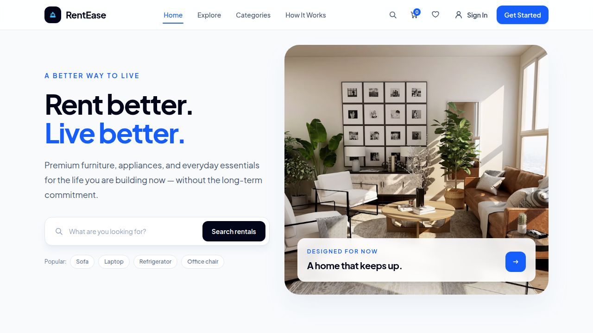
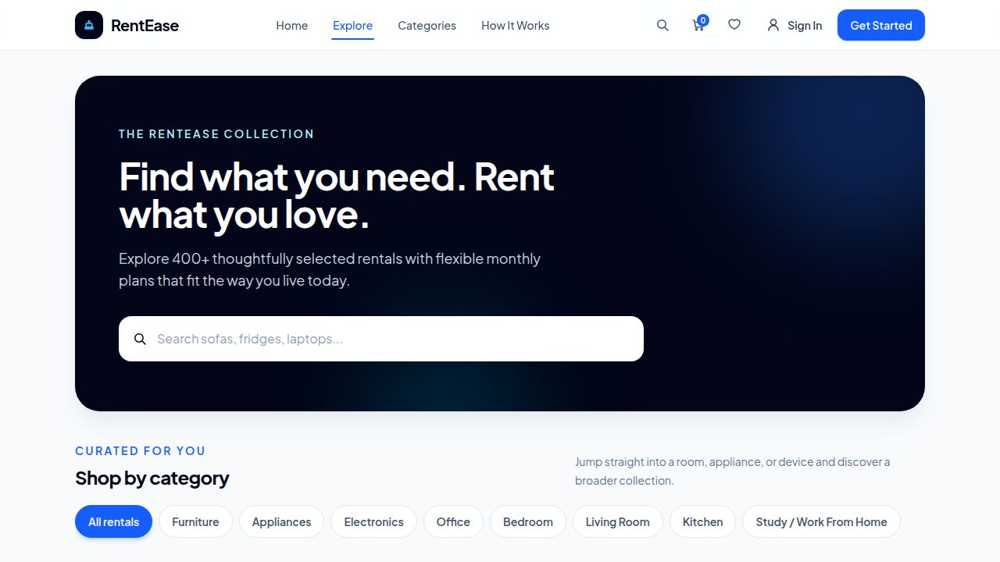
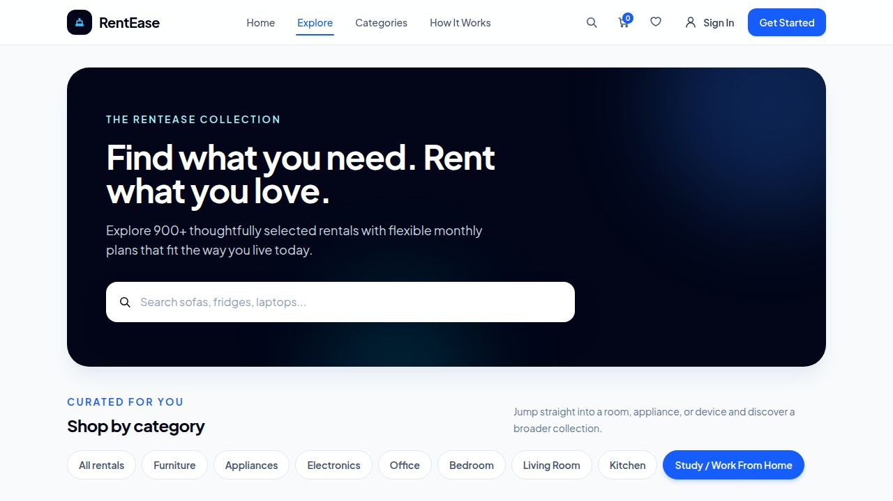
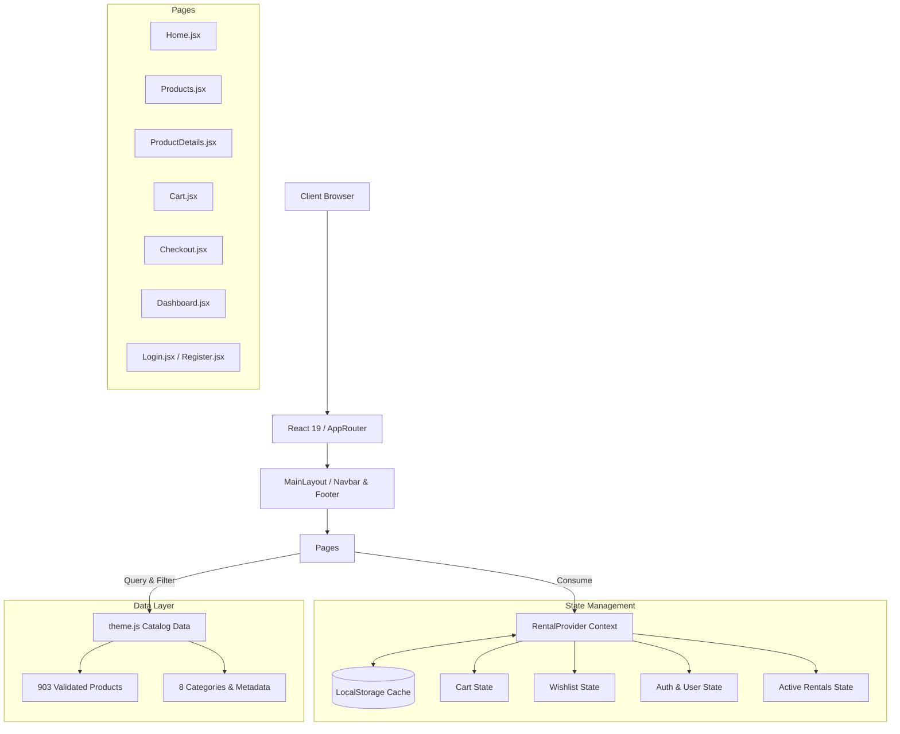

# RentEase

> A modern, flexible furniture, appliance, and electronics rental marketplace designed for hassle-free living. Built with React 19, Vite, Tailwind CSS v4, and React Router 7.

[](https://rent-ease-s1wi.vercel.app/)
[](https://react.dev/)
[](https://vitejs.dev/)
[](https://tailwindcss.com/)
[](LICENSE)

---

## 🔗 Live Demo

Experience the live application deployed on Vercel:  
👉 **[https://rent-ease-s1wi.vercel.app/](https://rent-ease-s1wi.vercel.app/)**

---

## 📖 Project Overview

**RentEase** solves the financial and logistical burden of furnishing modern living and working spaces. Purchasing high-end furniture, home appliances, and workstation tech requires hefty upfront capital and creates relocation headaches for mobile professionals and students. 

RentEase offers a subscription-based rental experience that enables users to:
- Browse a comprehensive catalog of **903 curated rental products** across 8 core categories.
- Select customized rental tenures (1, 3, 6, or 12 months) with transparent tenure-based discounts.
- Take advantage of zero-deposit incentives on long-term rentals (6+ months).
- Seamlessly manage cart items, estimate monthly totals and taxes, and complete checkout.
- Track active rental subscriptions, request zero-cost maintenance, and manage saved wishlists via a dedicated dashboard.

---

## ✨ Key Features

### 🛋️ 1. Comprehensive 903-Product Catalog
- Curated inventory spanning **8 major categories**: Living Room, Bedroom, Study / Work From Home, Appliances, Electronics, Office, Kitchen, and Furniture.
- Product availability across **12 major Indian cities** (Bengaluru, Mumbai, Delhi NCR, Hyderabad, Pune, Chennai, Kolkata, Jaipur, Ahmedabad, Chandigarh, Kochi, Surat).
- Detailed metadata including brand, dimensions, condition, warranty, delivery times, and multi-angle image galleries.

### 🔍 2. Parametric Search, Filtering & Sorting
- **Real-Time Search**: Instant keyword search across product titles, categories, and descriptions.
- **Multi-Faceted Filtering**: Filter by category, subcategory, city availability, price range, and minimum customer ratings.
- **Dynamic Sorting**: Sort items by Featured, Price (Low to High), Price (High to Low), and Highest Rated.
- **URL Synchronization**: Filters and search queries reflect directly in URL parameters for shareable catalog views.

### ⏱️ 3. Tenure-Based Dynamic Pricing & 0₹ Deposit
- Interactive tenure selector (1, 3, 6, 12 months) that automatically recalibrates monthly rental rates.
- Automatic zero-deposit calculation for plans of 6 months and above with transparent refundable deposit tracking.

### 🛒 4. Persistent Shopping Cart & Order Summary
- Global state-managed cart supporting quantity adjustments, tenure overrides, and persistent `localStorage` synchronization.
- Transparent price breakdown calculating monthly rent subtotal, refundable security deposit, 18% GST, and first-month payment due.

### 💳 5. Streamlined Multi-Step Checkout
- Delivery details configuration including city selector, phone verification, and preferred delivery time slots.
- Flexible payment methods (UPI/QR, Credit/Debit Cards, and Pay on Delivery).
- Order confirmation generator providing unique rental reference numbers (`RNT-XXXXX`) and estimated 48-hour delivery windows.

### 👤 6. User Authentication & Member Dashboard
- Simple sign-in and registration flows.
- **Active Rentals View**: Monitor active subscriptions, next billing dates, and registered delivery addresses.
- **Free Maintenance & Relocation**: Raise service requests or city relocation tickets directly from the dashboard.
- **Saved Wishlist**: Bookmark favorite items with one click and manage saved products.

### 📱 7. Responsive & Accessible Architecture
- Mobile-first, responsive layouts tailored for mobile, tablet, and widescreen desktop displays.
- Slide-out mobile navigation drawer with quick category shortcuts and search integration.
- Graceful image fallbacks and lazy-loading states for optimal performance.

---

## 📸 Screenshots

### Home Page


### Explore Products Catalog


### Category Filtering (Study & Work From Home)


### Featured 900+ Rentals Shelf


---

## 🏗️ Architecture & Data Flow



---

## 🛠️ Tech Stack

| Technology | Purpose |
| :--- | :--- |
| **React 19** | Core UI library for declarative, component-driven user interfaces |
| **Vite 8** | Next-generation frontend tooling and fast production bundler |
| **Tailwind CSS v4** | Modern utility-first CSS framework for responsive styling |
| **React Router 7** | Client-side routing, route parameters, and query string synchronization |
| **Context API** | Centralized application state management with local persistence |
| **ESLint 10** | Code quality enforcement and React Hooks linting rules |
| **Vercel** | Continuous deployment, global edge hosting, and asset distribution |

---

## 📂 Project Structure

```
RentEase/
├── public/
│   └── favicon.svg               # Application favicon
├── screenshots/                  # Verified application screenshots
│   ├── rentease-home-final.jpg
│   ├── rentease-products-final.jpg
│   ├── rentease-study-category-final.jpg
│   └── rentease-home-900-final.jpg
├── src/
│   ├── components/               # Shared presentational components
│   │   ├── ui/
│   │   │   ├── Badge.jsx
│   │   │   ├── Button.jsx
│   │   │   └── Card.jsx
│   │   ├── Footer.jsx            # Trust badges, links & contact info
│   │   ├── Navbar.jsx            # Header with search & category dropdown
│   │   ├── ProductCard.jsx       # Grid card with price, badge & tenure
│   │   └── ProductImage.jsx      # Image loader with graceful fallbacks
│   ├── constants/
│   │   └── theme.js              # Complete 903-product catalog & category data
│   ├── context/
│   │   ├── RentalContext.js      # React Context definition
│   │   ├── RentalProvider.jsx   # State provider for cart, wishlist & rentals
│   │   └── useRental.js          # Custom hook for consuming rental context
│   ├── layouts/
│   │   └── MainLayout.jsx        # App-wide layout shell (Navbar + Main + Footer)
│   ├── pages/
│   │   ├── Cart.jsx              # Cart page with breakdown & quantity controls
│   │   ├── Checkout.jsx          # Checkout form, slots & order confirmation
│   │   ├── Dashboard.jsx         # Subscriptions, service requests & wishlist
│   │   ├── Home.jsx              # Hero banner, category carousels & trust strip
│   │   ├── Login.jsx             # Member login authentication page
│   │   ├── NotFound.jsx          # 404 error fallback view
│   │   ├── ProductDetails.jsx    # Full product view, tenure selector & gallery
│   │   ├── Products.jsx          # Explore catalog with parametric filters
│   │   └── Register.jsx          # New member registration page
│   ├── routes/
│   │   └── AppRouter.jsx         # Declarative client-side route configuration
│   ├── App.jsx                   # Root component with providers & router
│   ├── index.css                 # Tailwind CSS imports & global styles
│   └── main.jsx                  # React DOM entry point
├── eslint.config.js              # ESLint configuration
├── index.html                    # HTML entry point with metadata tags
├── package.json                  # Dependencies, scripts and package metadata
├── vite.config.js                # Vite build and plugin configuration
└── README.md                     # Comprehensive project documentation
```

---

## 🚀 Getting Started

Follow these steps to set up and run RentEase locally on your machine.

### Prerequisites
- **Node.js** (v18.0.0 or higher recommended)
- **npm** (v9.0.0 or higher) or **yarn** / **pnpm** / **bun**

### Installation

1. **Clone the repository:**
   ```bash
   git clone https://github.com/sakshikadavkar/RentEase.git
   cd RentEase
   ```

2. **Install dependencies:**
   ```bash
   npm install
   ```

3. **Start the development server:**
   ```bash
   npm run dev
   ```

4. **Open in browser:**  
   Navigate to `http://localhost:3000` to preview the application.

---

## 📦 Production Build

To compile a minified production bundle ready for deployment:

```bash
# Run ESLint validation
npm run lint

# Build production bundle
npm run build

# Preview the production build locally
npm run preview
```

The optimized static assets will be output to the `dist/` directory.

---

## 🌐 Deployment

RentEase is optimized for zero-configuration static deployment on **Vercel**:
- **Framework Preset**: `Vite`
- **Build Command**: `npm run build`
- **Output Directory**: `dist`
- **Install Command**: `npm install`

Live Production Deployment: **[https://rent-ease-s1wi.vercel.app/](https://rent-ease-s1wi.vercel.app/)**

---

## 🔮 Future Enhancements

The following features represent conceptual enhancements planned for future iterations:
- **Backend & Database Integration**: Transition from client-side state to persistent cloud storage (PostgreSQL via Cloud SQL / Firebase Firestore) for multi-user session synchronization.
- **Payment Gateway Webhooks**: Live payment processing via Razorpay or Stripe integration with automated monthly subscription mandate recurring billing.
- **Digital KYC Verification**: Instant customer identity check via Aadhaar / PAN OCR verification before rental dispatch.
- **AI Recommendation Engine**: Smart room-builder suggestions powered by Gemini API based on apartment floor plans and budget.

---

## 👩‍💻 Author

**Sakshi Kadavkar**  
- GitHub: [@sakshikadavkar](https://github.com/sakshikadavkar)  
- Project Repository: [RentEase on GitHub](https://github.com/sakshikadavkar/RentEase)

---

## 📄 License

This project is open source and available under the [MIT License](LICENSE).
